# Azure Virtual WAN Route-Maps ASN guidance

<!-- TOC -->

- [Azure Virtual WAN Route-Maps ASN guidance](#azure-virtual-wan-route-maps-asn-guidance)
- [Introduction](#introduction)
- [TL;DR](#tldr)
- [ASN Testing](#asn-testing)
    - [Private ASN](#private-asn)
    - [ASN 12076](#asn-12076)
    - [A "normal" Public ASN](#a-normal-public-asn)
    - [A possible solution - Reserved Public ASN](#a-possible-solution---reserved-public-asn)
- [Appendix A - Combinations of Public and Private ASN](#appendix-a---combinations-of-public-and-private-asn)

<!-- /TOC -->

# Introduction

Customers making use of the Virtual WAN [route-maps](https://learn.microsoft.com/en-us/azure/virtual-wan/route-maps-about) feature (currently in public preview), for the purposes of AS-path-prepend outbound (towards On-Premises) via ExpressRoute, will expect that ASNs added to the path are preserved and sent to their CPE (connected to MSEE). They will use this behaviour to influence how their On-Premises networks send traffic to Azure. The most common scenario is shown below, and is an alternative to the traditional method of On-Premises Route Manipulation (typically by applying Local Preference to routes when they come inbound to Customer CPE).

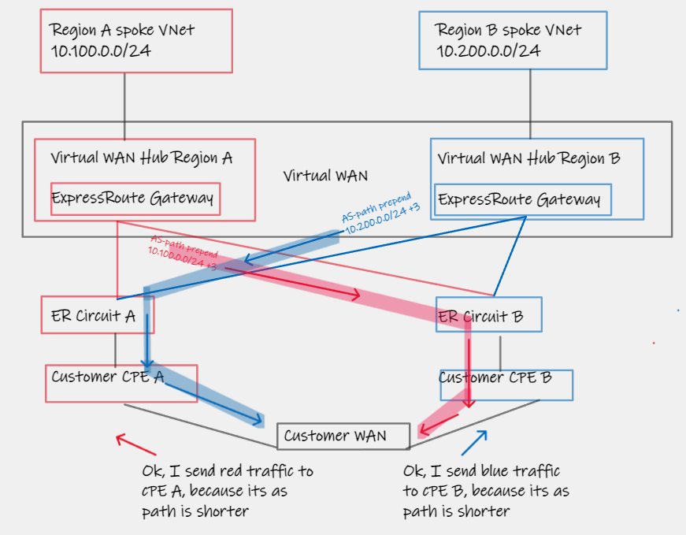

This behaviour relies on the AS-Path-prepend intent defined within the Virtual WAN Hub Route-Maps feature propagating all the way to the customer CPE, in other words, the AS-path added by the VWAN Hub, needs to remain appended to the route, as it leaves the Microsoft network (via the MSEE) outbound over the ExpressRoute Private Peering. 

The core message of this short tech note, is to provide guidance as to which AS Number (ASN) to use for this scenario, and which ASN will be preserved when leaving the Microsoft Edge Router (MSEE).

> Note this article is specific to ExpressRoute, and does not apply to VPN connected branches that may be using BGP.

# TL;DR

You need to use a Public ASN when prepending with the Route-Maps feature, otherwise this will get stripped by MSEE. This article proposes the use of Reserved Public ASN for this purpose.

# ASN Testing

## Private ASN

Here a short test to show that Private ASN are stripped when using them within the context of this article.

_VWAN Route-Map Rule, Prepend ASN 64500 64500 64500_
<br>
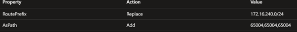

_Route is propagated to MSEE_
<br>
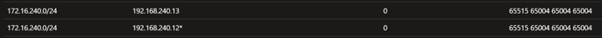

_Route is **not** propagated to customer_ (Note AS path is only AS 12076)
<br>
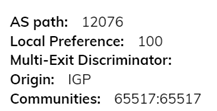

## ASN 12076

What about ASN 12076, the Azure ASN? Its a public ASN, can we not use that? No, as per Route-maps [docs](https://learn.microsoft.com/en-us/azure/virtual-wan/route-maps-about#:~:text=ASNs%3A%208074%2C%208075%2C-,12076,-Private%20ASNs%3A%2065515) this is prohibited, and causes traffic blackhole.

_VWAN Route-Map Rule, Prepend ASN 12076 12076 12076__
<br>
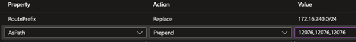

_Route is **not** propagated to MSEE_, as it sees its own ASN in the path, and rejects it as per normal BGP loop prevention.

## A "normal" Public ASN

Here we see a regular ASN (E.g. 1234) behaving as expected. The challenge here however, is, "what ASN would I pick?". If a customer uses their own ASN, their CPE will reject the route (same logic as previous section on 12076). If they cannot use their own ASN, then they must pick one randomly, and this is "bad bgp behaviour" as it will belong to another company somewhere in the world, and you could imagine corner cases where this route leaking around an Enterprise network might cause a very tricky issue to unpick.

But, for completeness, lets show this working anyway:

_VWAN Route-Map Rule, Prepend ASN 1234 1234 1234 _
<br>
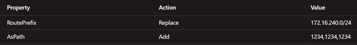

_Route is propagated to MSEE_
<br>
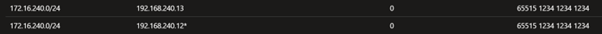

_Route is propagated to customer with prepend (Assuming of course they are not ASN 1234 themselves)_
<br>
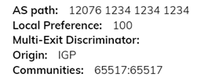

## A possible solution - Reserved Public ASN

As per [RFC 5398](https://datatracker.ietf.org/doc/html/rfc5398#:~:text=documentation%20purposes%2C%20namely-,64496%20%2D%2064511,-%2C%20and%20a%20contiguous) there is a block of ASN that are classified by routers as "Public", and are reserved for documentation/testing use. These ASN are in the range 64496 - 64511, and guaranteed to not overlap with either existing customer Public ASN, or any "normal" Public ASN used within the "Internet".

The captures below show a Route-Maps prepend with ASN 64500 successfully propagating fully through to On-Premises.

_VWAN Route-Map Rule, Prepend ASN 1234 1234 1234 _
<br>
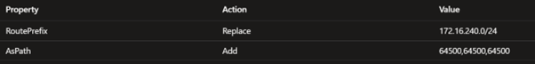

_Route is propagated to MSEE_
<br>
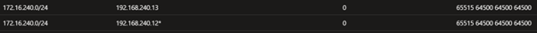

_Route is propagated to customer with prepend (Assuming of course they are not ASN 1234 themselves)_
<br>
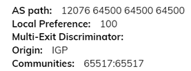

# Appendix A - Combinations of Public and Private ASN

[Add Context]


Examples of this behaviour are documented by some popular networking vendors 

E.g. Juniper [here](https://www.juniper.net/documentation/us/en/software/junos/bgp/topics/ref/statement/remove-private-edit-protocols-bgp.html#:~:text=The%20routing%20device%20stops%20searching%20for%20private%20ASs%20when%20it%20finds%20the%20first%20nonprivate%20AS%20or%20a%20peer%E2%80%99s%20private%20AS.) 
```
VWAN Route-Map Prepend: <no prepend>
Observed AS Path OnPremise: 12076

VWAN Route-Map Prepend: 65113,65111,65112,65113
Observed AS Path OnPremise: 12076

VWAN Route-Map Prepend: 1234,1234,1234
Observed AS Path OnPremise: 12076 1234 1234 1234

VWAN Route-Map Prepend: 65113,1234,65111,65112,65113
Observed AS Path OnPremise: 12076 1234 65111 65112 65113

VWAN Route-Map Prepend: 65113,65113,1234,65111,65112,65113
Observed AS Path OnPremise: 12076 1234 65111 65112 65113

VWAN Route-Map Prepend: 1234,65111,65112,65113
Observed AS Path OnPremise: 12076 1234 65111 65112 65113
```

E.g. Cisco [here](https://www.cisco.com/c/en/us/support/docs/ip/border-gateway-protocol-bgp/13756-32.html#:~:text=If%20the%20AS_PATH%20includes%20both%20private%20and%20public%20AS%20numbers%2C%20BGP%20doesn%27t%20remove%20the%20private%20AS%20numbers).

```
VWAN Route-Map Prepend: <no prepend>
Observed AS Path OnPremise: 12076

VWAN Route-Map Prepend: 65113,65111,65112,65113
Observed AS Path OnPremise: 12076

VWAN Route-Map Prepend: 1234,1234,1234
Observed AS Path OnPremise: 12076 65515 1234 1234 1234

VWAN Route-Map Prepend: 65113,1234,65111,65112,65113
Observed AS Path OnPremise: 2076 65515 65113 1234 65111 65112 65113

VWAN Route-Map Prepend: 65113,65113,1234,65111,65112,65113
Observed AS Path OnPremise: 12076 65515 65113 65113 1234 65111 65112 65113

VWAN Route-Map Prepend: 1234,65111,65112,65113
Observed AS Path OnPremise: 12076 65515 1234 65111 65112 65113
```

-